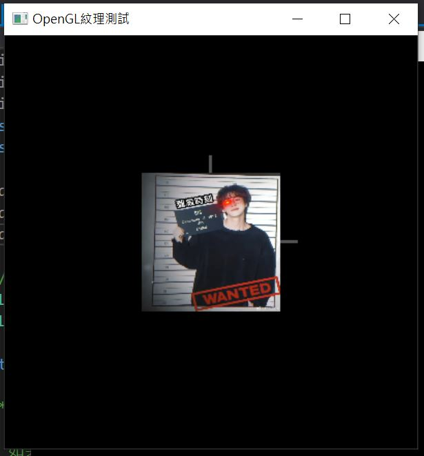

# OpenGL_Image
## load image in opengl using opencv  
如果如果圖片很小的話像素小不限制，但像素大的圖片像素大小限制要`4的倍數`  
不然load進glTexImage2D會有`ig9icd32.dll 存取違規`問題  

### 安裝opencv
教學: https://www.itread01.com/content/1546539304.html  
opencv現在不提供x86版本(32-bit)，因此要下載比較舊的版本(2.4.9)  
opencv2.4.9地址：https://sourceforge.net/projects/opencvlibrary/files/opencv-win/2.4.9/opencv-2.4.9.exe/download  

### 配置Visual Studio2019  
組態選Debug，平台選Win32  
屬性>VC++目錄>Include目錄 : 加入`opencv\build\include`  
屬性>VC++目錄>程式庫目錄 : 加入`opencv\build\x86\vc12\lib`  
屬性>連結器>輸入>其他相依性
```
opencv_core249d.lib
opencv_highgui249d.lib
opencv_imgproc249d.lib
```

### dll問題
執行後會一直跟你說找不到dll檔，請直接將檔案複製到`C:\Windows\SysWOW64`即可解決  
opencv的dll檔在`opencv\build\x86\vc12\bin`  
其他的dll: https://cvfiasd.pixnet.net/blog/post/179918357  
我把以上所需的檔案放在DLL資料夾裡，可直接下載移動  

### 測試
先運行此code，如果成功再加入opengl  
```
#include<opencv2\opencv.hpp>
using namespace cv;

int main() {
	//【1】讀入一張圖片
	Mat img = imread("圖片名稱");
	//【2】在視窗中顯示載入的圖片
	imshow("【載入的圖片】", img);
	//【3】等待3000ms後窗口自動關閉
	waitKey(3000);
}
```

### 使用opengl
範例code: https://blog.csdn.net/cd_yourheart/article/details/120667803   
```
#include <GL/freeglut.h>
#include <opencv2/opencv.hpp>
#include <iostream>
using namespace std;
using namespace cv;

#define WindowWidth  400
#define WindowHeight 400
#define WindowTitle  "OpenGL紋理測試"

//定義兩個紋理對象編號
GLuint texGround;
GLuint texWall;

static GLfloat angle = 0.0f;   //旋轉角度

/* 函數load_texture
* 讀取一個BMP文件作為紋理
* 如果失敗，返回0，如果成功，返迴紋理編號
*/
GLuint load_texture(const char* file_name)
{
	GLint width, height;
	GLubyte* pixels = 0;
	GLuint last_texture_ID = 0, texture_ID = 0;

	Mat I = imread(file_name);

	width = I.cols;
	height = I.rows;
	int pixellength = width * height * 3;
	//開闢指針空間
	pixels = new GLubyte[pixellength];
	//圖像指針複製
	memcpy(pixels, I.data, pixellength * sizeof(char));

	// 分配一個新的紋理編號
	glGenTextures(1, &texture_ID);
	if (texture_ID == 0)
	{
		free(pixels);
		return 0;
	}

	// 綁定新的紋理，載入紋理並設置紋理參數
	// 在綁定前，先獲得原來綁定的紋理編號，以便在最後進行恢復
	GLint lastTextureID = last_texture_ID;
	glGetIntegerv(GL_TEXTURE_BINDING_2D, &lastTextureID);
	glBindTexture(GL_TEXTURE_2D, texture_ID);
	glTexParameteri(GL_TEXTURE_2D, GL_TEXTURE_MIN_FILTER, GL_LINEAR);
	glTexParameteri(GL_TEXTURE_2D, GL_TEXTURE_MAG_FILTER, GL_LINEAR);
	glTexParameteri(GL_TEXTURE_2D, GL_TEXTURE_WRAP_S, GL_REPEAT);
	glTexParameteri(GL_TEXTURE_2D, GL_TEXTURE_WRAP_T, GL_REPEAT);
	glTexEnvf(GL_TEXTURE_ENV, GL_TEXTURE_ENV_MODE, GL_REPLACE);
	glTexImage2D(GL_TEXTURE_2D, 0, GL_RGB, width, height, 0,
		GL_BGR_EXT, GL_UNSIGNED_BYTE, pixels);
	glBindTexture(GL_TEXTURE_2D, lastTextureID);  //恢復之前的紋理綁定
	delete pixels;
	return texture_ID;
}


void display(void)
{
	// 清除屏幕
	glClear(GL_COLOR_BUFFER_BIT | GL_DEPTH_BUFFER_BIT);
	// 設置視角
	glMatrixMode(GL_PROJECTION);
	glLoadIdentity();
	gluPerspective(100, 1, 1, 50);
	glMatrixMode(GL_MODELVIEW);
	glLoadIdentity();
	gluLookAt(0, 0, 20, 0, 0, 0, 0, 1, 0);

	glRotatef(angle, 0.0f, 1.0f, 0.0f); //旋轉

	// 繪製底面以及紋理
	glBindTexture(GL_TEXTURE_2D, texGround);
	glBegin(GL_QUADS);
	glTexCoord2f(0.0f, 0.0f); glVertex3f(-8.0f, 8.0f, 0.0f);
	glTexCoord2f(0.0f, 1.0f); glVertex3f(-8.0f, -8.0f, 0.0f);
	glTexCoord2f(1.0f, 1.0f); glVertex3f(8.0f, -8.0f, 0.0f);
	glTexCoord2f(1.0f, 0.0f); glVertex3f(8.0f, 8.0f, 0.0f);
	glEnd();

	glLineWidth(3);
	glBegin(GL_LINES);
	glVertex3f(0.0f, 0.0f, 0.0f);
	glVertex3f(10.0f, 0.0f, 0.0f);
	glEnd();
	glBegin(GL_LINES);
	glVertex3f(0.0f, 0.0f, 0.0f);
	glVertex3f(0.0f, 10.0f, 0.0f);
	glEnd();
	// 繪製立面
	//glBindTexture(GL_TEXTURE_2D, texWall);
	//glBegin(GL_QUADS);
	//glTexCoord2f(0.0f, 0.0f); glVertex3f(-8.0f, 8.0f, 0.0f);
	//glTexCoord2f(0.0f, 1.0f); glVertex3f(-8.0f, 8.0f, 8.0f);
	//glTexCoord2f(1.0f, 1.0f); glVertex3f(8.0f, -8.0f, 8.0f);
	//glTexCoord2f(1.0f, 0.0f); glVertex3f(8.0f, -8.0f, 0.0f);
	//glEnd();

	//繪製另外一個立面
	//glBegin(GL_QUADS);
	//glTexCoord2f(2.0f, 0.0f); glVertex3f(6.0f, -3.0f, 0.0f);
	//glTexCoord2f(0.0f, 0.0f); glVertex3f(6.0f, 9.0f, 0.0f);
	//glTexCoord2f(0.0f, 1.0f); glVertex3f(6.0f, 9.0f, 5.0f);
	//glTexCoord2f(2.0f, 1.0f); glVertex3f(6.0f, -3.0f, 5.0f);
	//glEnd();

	glutSwapBuffers();
}

void myIdle(void)
{
	angle += 0.1f;
	if (angle >= 360.0f)
		angle = 0.0f;
	display();
}

int main(int argc, char* argv[])
{
	// GLUT初始化
	glutInit(&argc, argv);
	glutInitDisplayMode(GLUT_DOUBLE | GLUT_RGBA);
	glutInitWindowPosition(100, 100);
	glutInitWindowSize(WindowWidth, WindowHeight);
	glutCreateWindow(WindowTitle);
	glEnable(GL_DEPTH_TEST);
	glEnable(GL_TEXTURE_2D);    // 啟用紋理
	texGround = load_texture("jin.png");  //加載紋理
	texWall = load_texture("jin.png");
	cout << "###" << endl;
	glutDisplayFunc(display);   //註冊函數 
	glutIdleFunc(myIdle);
	glutMainLoop(); //循環調用
	return 0;
}
```
